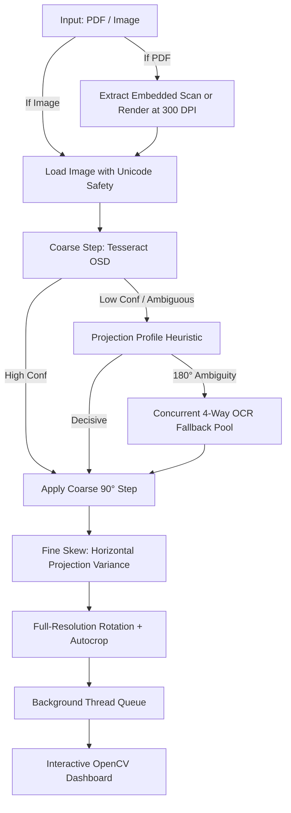

# 📄 High-Speed PDF & Image Orientation / Deskew Engine

An ultra-fast, multithreaded document orientation detector and sub-degree deskewing pipeline with an interactive OpenCV side-by-side dashboard.


---

## ⚡ Key Features

- **Zero-Loss PDF Extraction**:
  - Automatically identifies scanned PDF pages and extracts embedded full-page raster bitmaps directly with zero resampling loss.
  - Falls back to PyMuPDF high-DPI rendering for digital/vector documents.
- **Ensemble Coarse Orientation (0° / 90° / 180° / 270°)**:
  1. **Tesseract OSD** (fast orientation and script detection).
  2. **Projection Variance Profile** (orientation heuristic for line structure).
  3. **Concurrent 4-Way Deep OCR Fallback** (checks all 4 rotations in parallel when ambiguous).
- **Sub-Degree Fine Deskew**: Multi-scale horizontal projection variance optimizer with sub-degree accuracy ($0.05^\circ$ resolution).
- **Interactive Side-by-Side Dashboard**:
  - Full-screen OpenCV dashboard comparing raw scans against upright deskewed output.
  - Real-time time casting (exact milliseconds / seconds per page).
  - Manual override controls (`±90°`) and direct export.
- **Multithreaded Background Prefetching**: Prefetches pages using Python `ThreadPoolExecutor` so you can browse multi-page documents instantly without UI lag.

---

## 📁 Repository Structure

```text
orientation_app/
├── app.py              # Main interactive CLI application & runner
├── core.py             # Orientation, deskew algorithms & Tesseract error handler
├── pdf_converter.py    # Zero-loss PDF page extractor (PyMuPDF)
├── dashboard.py        # OpenCV comparison dashboard & UI rendering
├── requirements.txt    # Python dependencies
├── LICENSE             # MIT License
├── README.md           # Documentation
└── assist/
    ├── app_images/     # Screenshots & UI assets
    └── images/         # Bundled test sample images (auto-detected)
```

---

## 🛠️ Installation & Setup

### 1. Clone & Install Python Dependencies

```bash
cd orientation_app
pip install -r requirements.txt
```

### 2. Install Tesseract OCR

Tesseract OCR is recommended for high-accuracy 4-way deep orientation fallbacks:

- **Windows**:
  1. Download the installer from [UB-Mannheim/tesseract](https://github.com/UB-Mannheim/tesseract/wiki).
  2. Install it to `C:\Program Files\Tesseract-OCR` (the app automatically searches this path) or add it to your Windows System `PATH`.
- **Linux (Ubuntu / Debian)**:
  ```bash
  sudo apt update && sudo apt install tesseract-ocr
  ```
- **macOS**:
  ```bash
  brew install tesseract
  ```

> **Note**: If Tesseract is not installed, the engine gracefully alerts the user and falls back to mathematical projection profile heuristics.

---

## 🚀 Usage

### 1. Default Mode (Auto-loads Bundled Test Images)
If no arguments are passed, it automatically loads sample test images from `assist/images/`:
```bash
python app.py
```

### 2. Process a PDF Document
Convert and inspect all pages of a PDF:
```bash
python app.py "C:\Users\ASUS\Downloads\15April-BPV.pdf"
```

### 3. Process an Image Directory or Single Image
```bash
python app.py "path/to/scans_folder"
python app.py "path/to/scan.png"
```

### 4. Custom Options
```bash
python app.py "document.pdf" --workers 8 --out-dir my_corrected_docs --dpi 300 -v
```

| Flag | Description | Default |
|---|---|---|
| `input` | Path to PDF file, image file, or directory | `assist/images` |
| `-o`, `--out-dir` | Directory where corrected images are saved | `output_corrected` |
| `--workers` | Number of background worker threads | `4` |
| `--dpi` | DPI used when rendering born-digital PDF pages | `300` |
| `-v`, `--verbose` | Show debug logs in console | `False` |

---

## 🎮 Dashboard Controls

When the OpenCV viewer opens:

| Key | Action |
|---|---|
| `Right Arrow` / `D` / `N` / `Space` | Next Page / Image |
| `Left Arrow` / `A` / `P` | Previous Page / Image |
| `R` | Rotate Manual Override **+90°** |
| `L` | Rotate Manual Override **-90°** |
| `S` | Save current displayed image |
| `Q` / `Esc` | Exit Application |

---

## 🔬 How the Pipeline Works



---

## 📄 License

This project is open source and available under the [MIT License](LICENSE).
